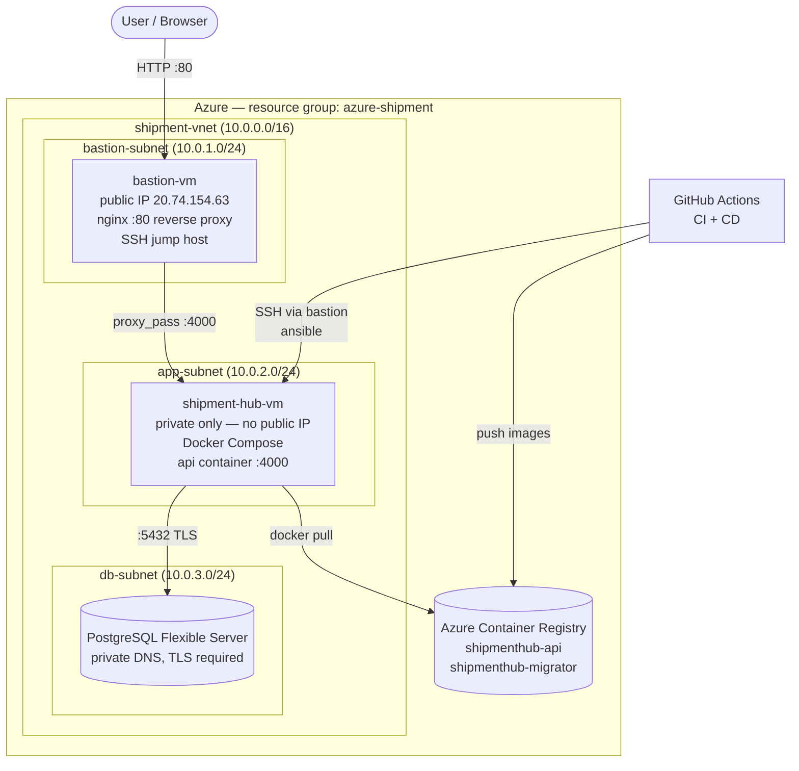

# ShipmentHub

Coordinate your shipments and give customers real-time visibility from pickup to delivery.

## Live application

| | |
|---|---|
| **Application** | http://20.74.154.63/ |
| **Health check** | http://20.74.154.63/health |
| **API root** | http://20.74.154.63/api/v1/ |
| **Public tracking** | `http://20.74.154.63/api/v1/track/<tracking-token>` |

Served through the bastion host's public IP, which reverse-proxies to the
application VM inside a private subnet.

## Our Problem Statement

Across many African countries, freight coordination still relies heavily on phone calls, messaging applications, and spreadsheets. This often results in poor communication, delayed updates, and limited visibility into shipment progress.

Customers frequently do not know where their cargo is, while operations teams spend significant time manually providing updates. ShipmentHub addresses this challenge by centralising shipment management, enabling real-time tracking, and improving communication between clients, operators, and recipients.

## Target Users

- Clients: Businesses or individuals who need goods transported and want visibility into their shipment status
- Operations Teams: Staff responsible for coordinating shipments, updating shipment statuses, and monitoring delivery progress
- Customers and Recipients: Anyone who receives a tracking link and wants to follow the progress of a shipment without creating an account

## Core Features

- User Authentication and Role Management: Secure login using JWT authentication with role-based access for clients and operators
- Shipment Requests: Clients can create shipment requests, provide cargo details, and specify pickup and delivery locations using an interactive map
- Operations Dashboard: Operators can manage all shipments from a single dashboard and monitor shipment activity in real time
- Status and Location Updates: Operators can update shipment status and location as cargo moves
- Public Shipment Tracking: Customers can track shipments through a secure shareable link without needing to create an account

## Technology Stack

- **Frontend:** Next.js 14, React 18, TypeScript, Tailwind CSS, Leaflet
- **Backend:** Node.js, Express.js, Sequelize ORM, JWT Authentication, Joi Validation, Helmet
- **Database:** PostgreSQL (Azure Database for PostgreSQL, Flexible Server)
- **Testing:** Jest, Supertest
- **Infrastructure:** Terraform (Azure), Ansible, Docker, Azure Container Registry
- **CI/CD:** GitHub Actions

## Architecture



**Why it is shaped this way.** The application VM holds the data path and has
no public IP at all. The only internet-facing host is the bastion, which
serves two jobs: it terminates public HTTP and proxies it inward, and it acts
as the SSH jump host for all administration and deployment. The database is
reachable only from inside the VNet and requires TLS.

## Repository layout

| Path | Purpose |
|------|---------|
| `api/` | Express API, Sequelize models, migrations, tests |
| `web/` | Next.js frontend |
| `terraform/` | Azure infrastructure, split into modules |
| `ansible/` | Server configuration and deployment playbooks |
| `.github/workflows/ci.yml` | Tests, linting, dependency / image / IaC scanning |
| `.github/workflows/cd.yml` | Build, push to ACR, deploy — runs on merge to `main` |

## Local development with Docker

### Prerequisites

- Docker Desktop installed and running
- Git installed

### 1. Clone the repository

```bash
git clone https://github.com/Shipment-Hub-Devops/shipment-hub.git
cd shipment-hub
```

### 2. Configure environment variables

Create a `.env` file in the repository root, alongside `docker-compose.yml`:

```env
DATABASE_URL=postgres://postgres:postgres@db:5432/shipmenthub_dev
JWT_SECRET=add-a-secure-local-secret-here
JWT_EXPIRES_IN=7d
```

### 3. Start the application

```bash
docker compose up --build -d
```

The API waits for PostgreSQL to become healthy before starting.

### 4. Apply database migrations

The application does not create its own schema — it only verifies the
connection. Migrations must be applied explicitly:

```bash
docker compose exec api npx sequelize-cli db:migrate
```

### 5. Verify

Open http://localhost:4000/health — a successful response confirms the API is
running.

### 6. Stop

```bash
docker compose down      # stop containers
docker compose down -v   # also remove the database volume
```

---

# Operations manual

## Provisioning the infrastructure

### Prerequisites

- Terraform >= 1.5
- Azure CLI, logged in (`az login`)
- An SSH key pair at `~/.ssh/id_rsa` / `~/.ssh/id_rsa.pub`

### Steps

```bash
cd terraform
cp terraform.tfvars.example terraform.tfvars
```

Fill in `terraform.tfvars`. Three values must be unique or environment-specific:

| Variable | Notes |
|----------|-------|
| `subscription_id` | Required, no default. `az account list --output table`. Deliberately explicit so Terraform cannot deploy into the wrong subscription when the CLI is signed in to several tenants. |
| `registry_name` | Globally unique across Azure, alphanumeric only |
| `db_server_name` | Globally unique — becomes `<name>.postgres.database.azure.com` |

Then:

```bash
terraform init
terraform plan     # always read this before applying
terraform apply
```

**Note:** state is currently stored locally in `terraform/terraform.tfstate`
and is gitignored. It is not shared between machines and has no locking. Move
it to an Azure Storage backend before more than one person applies changes.

### Outputs

```bash
terraform output
```

| Output | Feeds |
|--------|-------|
| `bastion_public_ip` | Public URL, Ansible inventory, `JUMPBOX_IP` secret |
| `app_vm_private_ip` | Ansible inventory, `APP_VM_PRIVATE_IP` secret. **Dynamically assigned — never hardcode it.** |
| `database_fqdn` | Building `DATABASE_URL` |
| `registry_login_server` | `ACR_LOGIN_SERVER` secret |
| `registry_admin_username` / `registry_admin_password` | ACR credentials |

## Configuring the servers

```bash
cd ansible
ansible-galaxy collection install -r requirements.yml
cp inventory.summative.ini inventory.live.ini
```

Fill both addresses in `inventory.live.ini` from the Terraform outputs above.

```bash
# Install Docker, Docker Compose, UFW and SSH hardening on the app VM
ansible-playbook -i inventory.live.ini playbook.yml

# Configure nginx on the bastion so the app is publicly reachable
ansible-playbook -i inventory.live.ini jumpbox.yml
```

`ansible-core` alone is not sufficient — the playbooks use `community.docker`
and `community.general`, which is why `requirements.yml` must be installed
first.

## Deploying the application

Normally handled by the CD pipeline on merge to `main`. To deploy by hand:

```bash
ansible-playbook -i inventory.live.ini deploy.yml \
  -e registry_server=<acr>.azurecr.io \
  -e registry_username=<user> \
  -e registry_password=<password> \
  -e app_image=<acr>.azurecr.io/shipmenthub-api:latest \
  -e migrator_image=<acr>.azurecr.io/shipmenthub-migrator:latest \
  -e database_url='postgresql://...' \
  -e jwt_secret='...' \
  -e use_managed_db=true
```

The playbook logs in to the registry, renders the production compose file,
pulls the images, **applies migrations, then starts the API**, and finally
fails if any migration is still pending.

Migrations run from a separate `migrator` image built from a dedicated
Dockerfile stage. The runtime image deliberately excludes `sequelize-cli` —
and npm entirely — to keep build tooling out of production.

## CI/CD

**CI** (`ci.yml`) runs on every push and pull request:

| Job | Gate |
|-----|------|
| `backend` (Node 18 and 20) | Lint and full Jest suite against a PostgreSQL service |
| `dependency-scan` | `npm audit --audit-level=high --omit=dev` — blocks on production dependencies; a full-tree audit runs non-blocking for visibility |
| `image-scan` | Trivy, report-only |
| `iac-scan` | Checkov against `terraform/` |
| `frontend` | Skips until `web/package.json` is committed |

**CD** (`cd.yml`) runs only on merge to `main`: re-runs the quality gates,
builds and pushes both images to ACR (failing on CRITICAL findings), then
deploys via Ansible over SSH through the bastion.

### Required repository secrets

`ACR_LOGIN_SERVER`, `ACR_USERNAME`, `ACR_PASSWORD`, `SSH_PRIVATE_KEY`,
`JUMPBOX_IP`, `APP_VM_PRIVATE_IP`, `VM_ADMIN_USER`, `DATABASE_URL`,
`JWT_SECRET`

`DATABASE_URL` has no single Terraform output and must be assembled:

```
postgresql://<admin>:<url-encoded-password>@<database_fqdn>:5432/shipmenthub?sslmode=require
```

## Rolling back

Images are tagged with both `latest` and the commit SHA, so a previous build
can be redeployed without rebuilding:

```bash
ansible-playbook -i inventory.live.ini deploy.yml \
  -e app_image=<acr>.azurecr.io/shipmenthub-api:<previous-sha> \
  ... remaining variables as above
```

Migrations are not rolled back automatically. Undo the most recent one with:

```bash
docker compose run --rm migrate node_modules/.bin/sequelize-cli db:migrate:undo
```

## Troubleshooting

| Symptom | Cause and fix |
|---------|---------------|
| `/health` returns 200 but data endpoints return 500 | Schema missing. `/health` is a static route that never touches the database. Check the migration step in the deploy output. |
| Deploy fails on `community.docker.docker_login` | Collections not installed. Run `ansible-galaxy collection install -r ansible/requirements.yml`. |
| nginx returns 502 | The proxy target does not match `app_vm_private_ip`. That address is dynamically assigned — re-read it with `terraform output` and update the inventory. |
| Terraform plans changes nobody made | Confirm `subscription_id` points at the intended subscription. |
| `ServerNameAlreadyExists` on apply | `db_server_name` is globally unique across Azure. Choose another. |

## Branch Protection (main)

The `main` branch is protected to enforce our DevOps review workflow:

- **Require pull request + 1 approval** — no code reaches main without peer review.
- **Dismiss stale approvals** — re-review is forced if new commits are pushed after approval.
- **Require status checks** — CI must pass before merge.
- **Require branches up to date** — prevents broken merges from out-of-date branches.
- **Require conversation resolution** — all review comments must be addressed.
- **Include administrators** — rules apply to everyone, no exceptions.

## Security

Scanning tools, findings, accepted risks and the remediation plan are
documented in [SECURITY.md](SECURITY.md). This includes the rationale for
SSH being reachable from the internet and the compensating controls applied.
